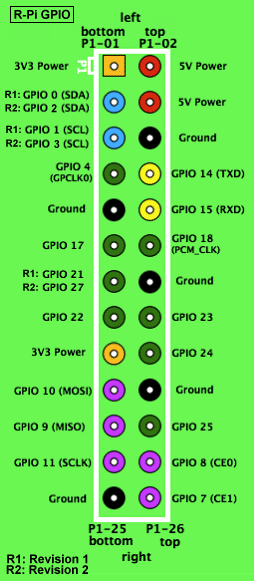

# raspi-temp-monitor
This project is made up of three different parts described below. This project exists to provide a way of monitoring the temperature  of a room with data being collected by a server (in my case a VPS) somewhere else.

All of the code here was designed for a Raspberry Pi B and written in nodejs as that's the language I have been doing recently. Nothing here uses the normal Raspberry Pi GPIO. I am taking advantage of the fact that the DS1820 sensor uses the 1-wire interface and can be accessed through the normal Linux filesystem on the Pi.

### 1) Raspberry Pi Client
This code uses a DS1820 temperature  sensor to read the temperature  value of the room and reports it to the server part of this code every 2 hours using the cron npm package

### 2) Server Code/REST API
Using the Restify npm package there is a basic REST API with some simple calls that the client can make to report the room temperature  back to the server.

Eventually the server will have some extra features to determine if the Raspberry Pi has not checked in for several hours and will notify a list of pre-configured people by email that something is wrong with the Pi/Internet/Power.

### 3) Server Website Code
This is currently not implemented.
This is the web interface viewer for the collected data. Data collected will have a timestamp and a temperature . This means the interface should show a graph of the date/temp data as well as some averages per week and maybe min/max temps.

# Other Notes
This code assumes using the DS18B20 sensor connected with w1. You must add "dtoverlay=w1-gpio" to your /boot/config.txt in order to use the device! This took me a while to figure out.
Note: You need to make TWO edits to the client.js code, see the comments

# Hardware Setup
Wiring the Sunfounder DS18B20 temperature sensor to a RPI B 1 or above.  Other DS18B20 sensors will also work, color codes may change.

Sunfounder    RPI 
red wire      3v3 power
black wire    ground
yellow wire   GPIO 4

Load the Linux device drivers

sudo modprobe w1-gpio
sudo modprobe w1-therm

Now cd to the device directory cd /sys/bus/w1/devices/   
ls to find your device ID.  It will have id of the form: 28-000006b4a69b

Use the cat command to read it : cat 28-000006b4a69b/w1_slave

This will display the following:  23125 is the 23.125 degrees C.

72 01 4b 46 7f ff 0e 10 57 : crc=57 YES
72 01 4b 46 7f ff 0e 10 57 t=23125

# Other Software setup 
Load node on Pie Gen 1 Mod B – Arm V6
Login into the RPI
cd ~
Get the Arm V6 binary (for a RPI B1 only) 
wget https://nodejs.org/dist/v6.2.1/node-v6.2.1-linux-armv6l.tar.gz

Extract the binary:
tar -xzf node-v6.2.1-linux-armv6l.tar.gz

Verify the binary:
node-v6.2.1-linux-armv6l/bin/node -v
The last command should print: v6.2.1.
Now you can copy it to /usr/local:
cd node-v6.2.1-linux-armv6l/
then copy:
sudo cp -R * /usr/local/

For testing add: /usr/local/bin to your path             pi/raspberry
export PATH=$PATH:/usr/local/bin
node -v
npm -v

# Chrontab
To be useful, the temperature monitor needs to run evey 1/2 hour.  
Write a cron entry to run:   node client.js
